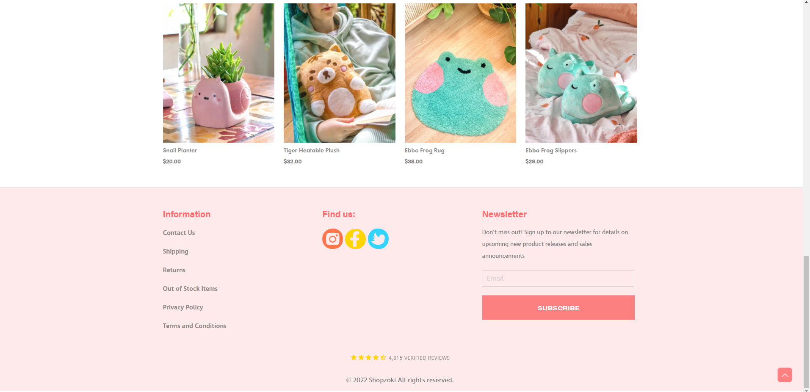
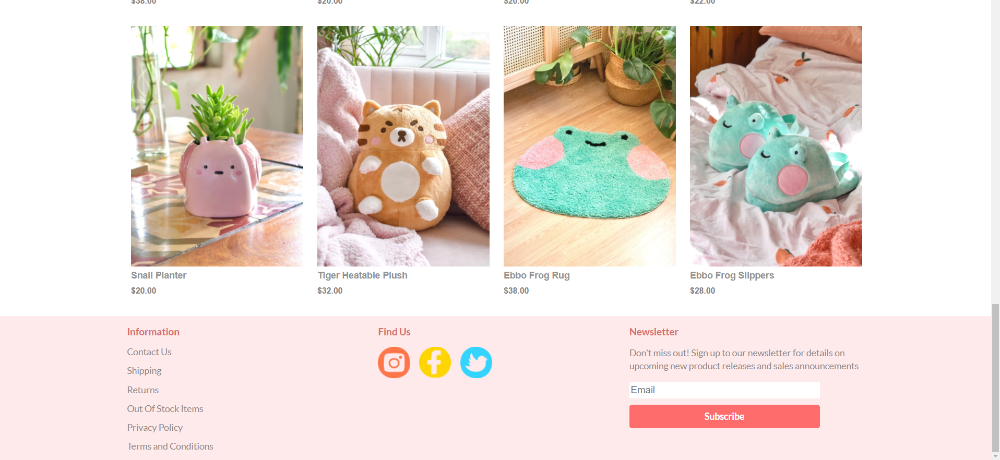

## So That’s What Semantic Means...

The definition of semantic is relating to meaning in language or logic. When used in talking, this means that you can say multiple things that have the same meaning but different contexts behind it. An example of this is saying “game over” and “your time is up.” Both statements mark the end of something but there are different feelings you get from them. All of this relates to Semantic UI because the goal of it is to help organize a website but there are many different ways to “say” it. Semantic UI is a front-end development framework that contains HTML components that help create organized layouts on webpages. In ICS 314, we have been using Semantic UI to recreate websites of local companies. After having hands-on experience for a week, I understand how it can be a helpful tool in making laying out webpages much easier. Grids, menus, and containers were used to divide up sites into sections and easily manipulate the items inside of those classes. Semantic UI also has positioning words to use in classes such as “right fitted” to align items exactly where you want them. These and many more classes make it simple to set up a good looking site efficiently. 

## Suffering From Success
Although there are many useful features of Semantic UI, one of the hardest parts of learning Semantic UI are the many features. More specifically, trying to remember all of the classes and the ways those classes can be manipulated. When I was trying to use multiple classes by stringing them together or nesting them, I struggled trying to understand how it all gets put together. I also found it frustrating when I try to stylize an item but it doesn’t turn out how I wanted it to be. Centered items not being fully centered, images not sizing correctly, or items just not moving when you ask it too. Even if you asked very nicely. This is likely due to incorrect setup of containers and grids but as I mentioned before, these were a little difficult for me to put together. 

## Why I want to Use UI Frameworks
I am sure that many of my struggles now will go away as we spend more time with Semantic UI and UI Frameworks in general. Looking at more examples and practicing will get me familiar with the elements and more comfortable using them. With only a week of learning Semantic UI, there will inevitably be many features that I forgot or haven't seen that could make my code even more concise and organized. I want to be able to get the most out of UI Frameworks because it seems like a powerful and concise tool for efficiently organizing a website. Another major feature of UI Frameworks is the adaptability to different screen sizes and devices. Making a website with a UI Framework on a computer means you are making a website for a laptop and even a phone as long as the website is set up correctly. This can be a huge time saver in a field where time is a very important resource. 

## Some Unfounded Confidence
After learning about HTML and CSS and using it for two weeks, I find myself looking at other websites and thinking about how it was put together. I never noticed it before, but many websites have similar parts to them like the menu bar at the top or the footer. The contents are different of course, but the way they are setup are similar across the board. I recently started to  think “I can do that,” even though I probably can’t, but I can probably get pretty close. One of our assignments for ICS 314 was to recreate a site of our choosing using Semantic UI. It was difficult to get through as mentioned before and there were many things wrong along the whole webpage, but in the end I like to think it came out pretty close. As we continue to learn about web design and UI Frameworks, I hope to perfect my craft and create better looking websites.

Original Website

My Recreation
