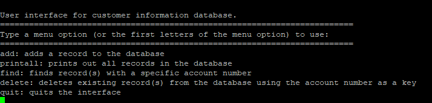
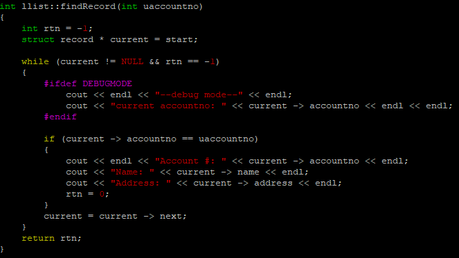

## A Database With Names, Numbers, and Addresses

This program is my final project for ICS 212 written in C++. It is a database that stores information about a person in a linked list. You could also search for a specific person, delete a person from the list, or print out the list. The program could also save the information in the list when you exit the program and add it back when you run the program again. Below is an example of the method that is used to search for a person in the list using their id.

## My First Experience With C/ C++
ICS 212 was the first ICS class that really got me out of my comfort zone. After using Java for so long, I had gotten used to its rules. Getting into C, in particular, was difficult for me because of the new ideas I had never seen before. Pointers were a big part of C and it took a while for me to understand how it worked. There was also much more attention given to how memory was allocated in a program which was hard for me to keep track of. However, over time I got more comfortable with the language as we continued through the assignments. My work was never perfect, even my final project had mistakes, but I definitely feel more comfortable using C and C++. The class also taught me how to use a console and the “Vi” editor which will definitely be helpful in the future. 
