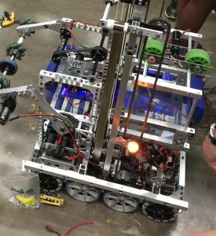
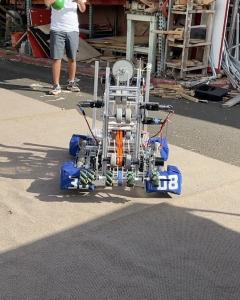
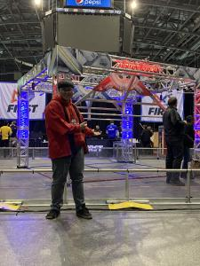

  
  

I spent 4 years being part of my high school robotics team, Magma Robotics. In our robotics team, we create a robot around a game that changes every year. We have six weeks to create a robot then compete in tournaments hosted around the world. I didn’t contribute much during my freshman year but I got more into it during my sophomore year. I was a part of our electrical subteam that dealt with the electrical components on our robot, such as batteries, wiring, motors, and sensors. Then in my junior year, I joined the programming team because it was the same year I started taking my computer science class. Our subteam worked together to program a robot that fulfilled all of the requirements that the game asked of us. Although we worked in Java, coding for a robot was much different than making a program so there was a lot to pick up. I stayed on the programming team in my senior year to continue learning about programming for robotics.

There was more to the robotics team than just building a robot and competing. Our team was also a non profit organization where the money we earned goes to getting robot parts and funding trips. The main products our team sold were Bristlebots and 3D wooden puzzles. To make the wooden puzzles, I learned how to use a laser printer. To sell these products I learned how to talk with customers at craft fairs. To get our name out there in the community we did robot demonstrations at schools and at public events as well as doing community service like a beach cleanup. These events were also organized and planned out by us. We did all of these things so that the team can sustain itself and continue to live on.

Being on the robotics team has taught me so many invaluable things. Not only did I learn many STEM related skills, I also learned leadership, cooperation, organization, and entrepreneurship. I also got to travel to Canada and Taiwan to compete and meet other teams from around the world and learn from their advice. There are many experiences that I gained from the robotics team that made me grow and become a more developed person. 

This was the code for our 2020 robot: <a href="https://github.com/FRCTeam3008/FRC2020Infinite_Recharge_New"><i class="large github icon"></i>FRCTeam3008/FRC2020Infinite_Recharge_New</a>
