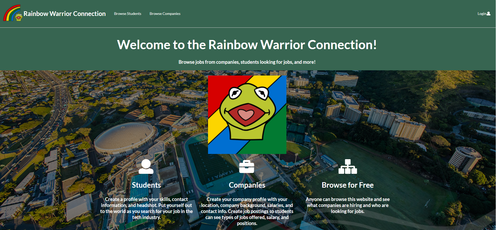
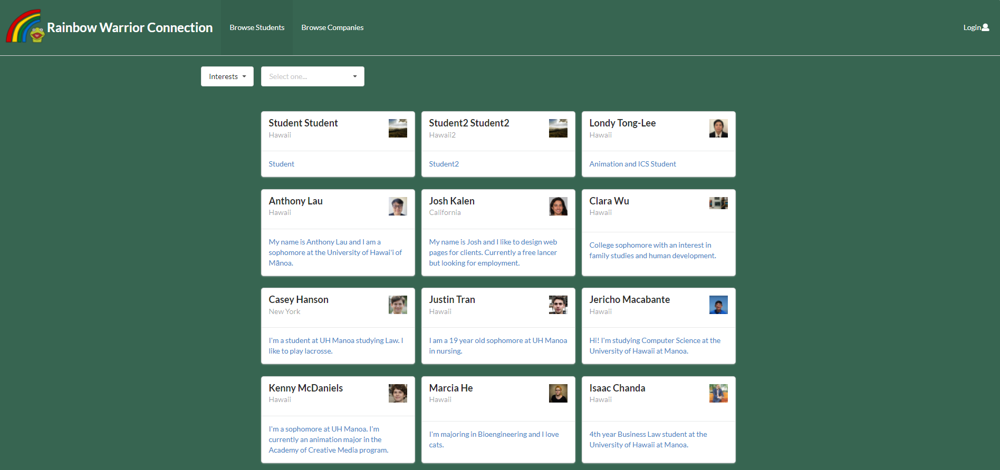
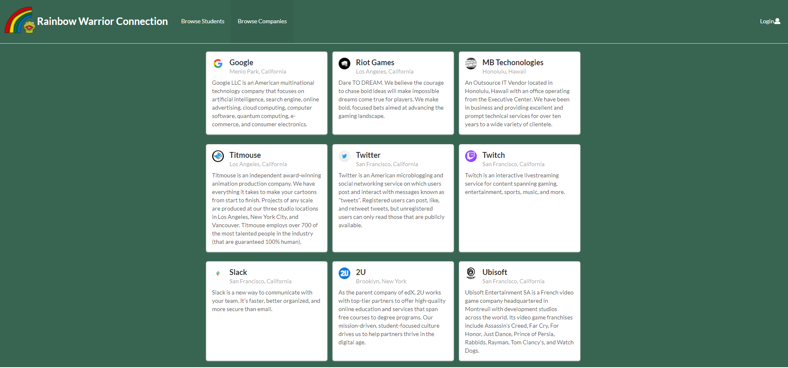
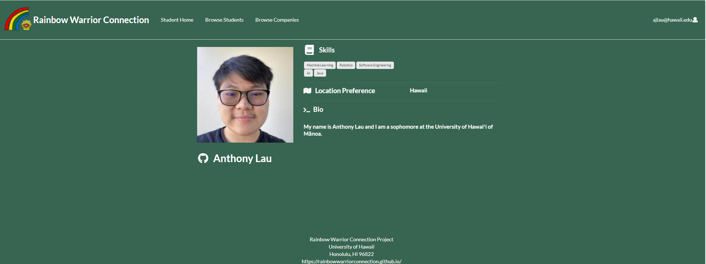

## The Rainbow (Warrior) Connection

For our final project in ICS 314, I worked in a team to create the [Rainbow Warrior Connection](http://159.89.232.121/#/). The purpose of the website is to bring computer science and software engineering students from UH Manoa together with companies from around the US in a central hub.

On the website, students can create profiles and share information about themselves and what interests they have for a job. Companies are also able to create profiles where they can share descriptions about their company and post job listings. These profiles are then put on the "Browse Students" and "Browse Companies" pages where people can look through the existing profiles of other students or companies.

You can also click on the cards of students to bring up more information about them and you can click on company cards to bring up their job listings as well as more information.

## Doing My Part
For this project, I mostly worked on pages that use the 'Student' collection. I created the student home page modeled after the Bowfolios user home page and I worked on the student profile page by designing a layout for the page and connecting the 'Interests' collection to that page. Making the cards clickable was also something I did which required moving components around. Lastly, I helped with cleaning up the project and checking for ESLint errors.

## A New Shared Experience
From this project, I learned about how to work in a team environment. I learned about Github 'etiquette' such as standardizing branch names and how pull requests work. Communication was an important skill that we worked on throughout the project. I also learned a new way of working through a project called issue driven project management where issues that need to be worked on are put on a public board. This project also taught me how to deploy a website to the internet. Lastly, I got to strengthen my knowledge of Meteor and code writing in general. These are some very important skills that are extremly practical as I continue my computer science journey.

For more information about the Rainbow Warrior Connection visit [here](https://rainbowwarriorconnection.github.io/).
This is the Github repository for the website: <a href="https://github.com/rainbowwarriorconnection/rainbowwarriorconnection"><i class="large github icon"></i>rainbowwarriorconnection/rainbowwarriorconnection</a>
